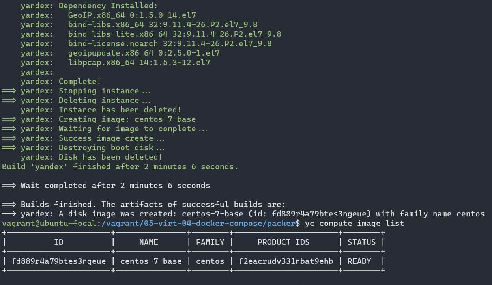
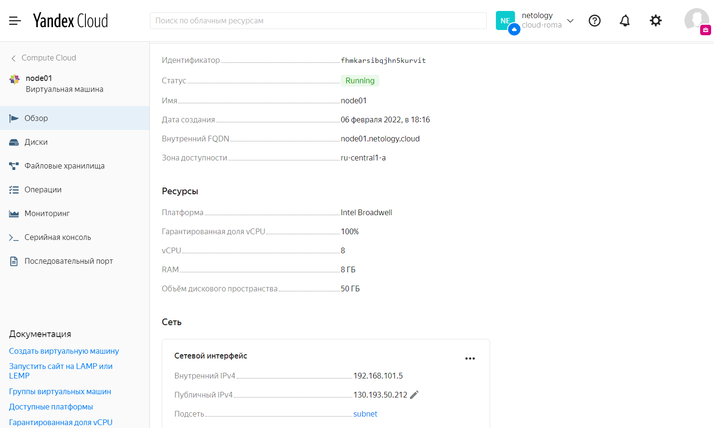
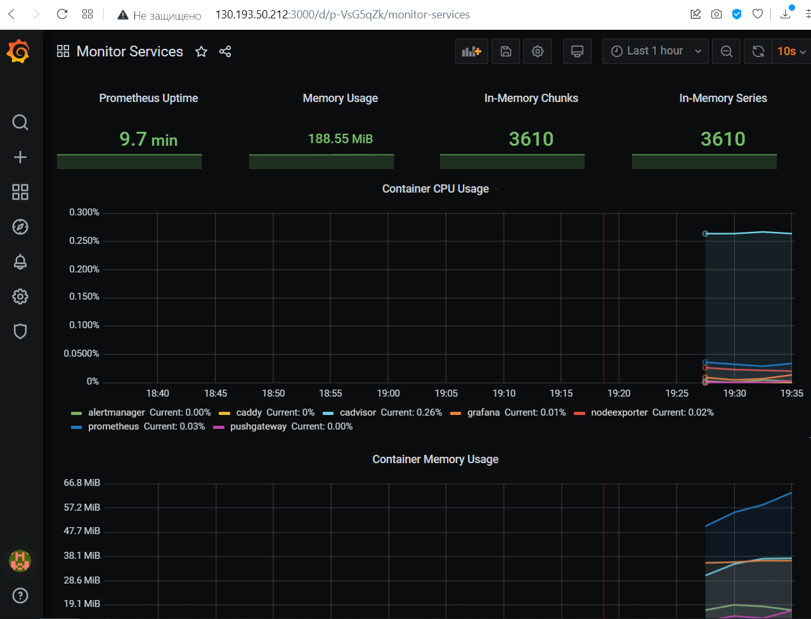

# 5.4. Оркестрация группой Docker контейнеров на примере Docker Compose

## Задача 1

Создать собственный образ операционной системы с помощью Packer.

**Ответ**

<p align="center">
  
</p>

### Шаг 0: Подготовка окружения
1. Запускаем виртуалку на Linux
   ```rust
   Vagrant.configure("2") do |config|
     config.vm.box = "ubuntu/focal64"
     config.vm.provider "virtualbox" do |vb|
       vb.name = "Main"
       vb.memory = "2048"
	   vb.cpus = 2
     end
   end
   ```
2. Создаём шаренную папку 05-virt-04-docker-compose и копируем в неё ресурсы (файлы для packer, terraform, ansible)
3. Регистрируемся на Yandex.Cloud и используем промокод
4. Удаляем автосозданные сети и подсети из папки ``default``, создаём собственную ``netology``

### Шаг 1: Установка клиента Yandex.Cloud
```bash
$ curl https://storage.yandexcloud.net/yandexcloud-yc/install.sh | bash
  % Total    % Received % Xferd  Average Speed   Time    Time     Time  Current
                                 Dload  Upload   Total   Spent    Left  Speed
100  9739  100  9739    0     0  77912      0 --:--:-- --:--:-- --:--:-- 77912
Downloading yc 0.87.0
  % Total    % Received % Xferd  Average Speed   Time    Time     Time  Current
                                 Dload  Upload   Total   Spent    Left  Speed
100 81.2M  100 81.2M    0     0  4419k      0  0:00:18  0:00:18 --:--:-- 4287k
Yandex.Cloud CLI 0.87.0 linux/amd64

yc PATH has been added to your '/home/vagrant/.bashrc' profile
yc bash completion has been added to your '/home/vagrant/.bashrc' profile.
Now we have zsh completion. Type "echo 'source /home/vagrant/yandex-cloud/completion.zsh.inc' >>  ~/.zshrc" to install itTo complete installation, start a new shell (exec -l $SHELL) or type 'source "/home/vagrant/.bashrc"' in the current one

$ echo 'source /home/vagrant/yandex-cloud/completion.zsh.inc' >>  ~/.zshrc
$ source "/home/vagrant/.bashrc"
$ yc --version
Yandex.Cloud CLI 0.87.0 linux/amd64
```
### Шаг 2: Инициализация и первичная настройка Yandex.Cloud
1. Вводим команду ``yc init`` и переходим по указанной ссылке
2. Получаем токен и вводим его
3. Выбираем созданную ранее папку ``netology``
4. Выбираем зоную доступа ``ru-central1-a`` (т.к. она используется в конфигах далее)

```bash
$ yc init
Welcome! This command will take you through the configuration process.
Please go to https://oauth.yandex.ru/authorize?response_type=token&client_id=MY_ID in order to obtain OAuth token.

Please enter OAuth token: MY_API_TOKEN
You have one cloud available: 'cloud-roma' (id = b1gjn3v7sno758hjjba0). It is going to be used by default.
Please choose folder to use:
 [1] default (id = b1gdbsrbugl140ih7lgp)
 [2] netology (id = b1gr1vdb5g3ktr8v0877)
 [3] Create a new folder
Please enter your numeric choice: 2
Your current folder has been set to 'netology' (id = b1gr1vdb5g3ktr8v0877).
Do you want to configure a default Compute zone? [Y/n] y
Which zone do you want to use as a profile default?
 [1] ru-central1-a
 [2] ru-central1-b
 [3] ru-central1-c
 [4] Don't set default zone
Please enter your numeric choice: 1
Your profile default Compute zone has been set to 'ru-central1-a'.
```
### Шаг 3: Создаём сеть и подсеть для работы packer
```bash
$ yc vpc network create --name net --labels my-label=netology --description "my first network via yc"
id: enpbf7hk34227thef30v
folder_id: b1gr1vdb5g3ktr8v0877
created_at: "2022-02-06T12:54:31Z"
name: net
description: my first network via yc
labels:
  my-label: netology

$ yc vpc subnet create --name my-subnet-a --zone ru-central1-a --range 10.1.2.0/24 --network-name net --description "my first subnet via yc"
id: e9b7k86eethgliqmku5r
folder_id: b1gr1vdb5g3ktr8v0877
created_at: "2022-02-06T12:55:21Z"
name: my-subnet-a
description: my first subnet via yc
network_id: enpbf7hk34227thef30v
zone_id: ru-central1-a
v4_cidr_blocks:
- 10.1.2.0/24
```
### Шаг 4: Устанавливаем сам packer
Переходим на сайт разработчика [Packer.io](https://www.packer.io/downloads) и следуем инструкции для Ubuntu
```bash
$ curl -fsSL https://apt.releases.hashicorp.com/gpg | sudo apt-key add -
OK
$ sudo apt-add-repository "deb [arch=amd64] https://apt.releases.hashicorp.com $(lsb_release -cs) main"
Hit:1 http://archive.ubuntu.com/ubuntu focal InRelease
...
Get:40 http://archive.ubuntu.com/ubuntu focal-backports/multiverse amd64 c-n-f Metadata [116 B]
Fetched 20.9 MB in 24s (885 kB/s)
Reading package lists... Done

$ sudo apt-get update && sudo apt-get install packer
Hit:1 http://security.ubuntu.com/ubuntu focal-security InRelease
...
Setting up packer (1.7.10) ...
$ packer --version
1.7.10
```
### Шаг 5: Редактируем конфигурационный файл для создания образа
Проверяем, что в файле ``/packer/centos-7-base.json`` указаный правильные ``folder_id``, ``subnet_id`` (см. шаг 3) и ``token``
```json
{
  "builders": [
    {
      "disk_type": "network-nvme",
      "folder_id": "b1gr1vdb5g3ktr8v0877",
      "image_description": "by packer",
      "image_family": "centos",
      "image_name": "centos-7-base",
      "source_image_family": "centos-7",
      "ssh_username": "centos",
      "subnet_id": "e9b7k86eethgliqmku5r",
      "token": "MY_API_TOKEN",
      "type": "yandex",
      "use_ipv4_nat": true,
      "zone": "ru-central1-a"
    }
  ],
  "provisioners": [
    {
      "inline": [
        "sudo yum -y update",
        "sudo yum -y install bridge-utils bind-utils iptables curl net-tools tcpdump rsync telnet openssh-server"
      ],
      "type": "shell"
    }
  ]
}
```
### Шаг 6: Собираем образ
Переходим в папку с конфигурационным файлом packer'а для создания образа, валидируем и собираем
```bash
$ cd packer
$ packer validate centos-7-base.json
The configuration is valid.
$ packer build centos-7-base.json
yandex: output will be in this color.

==> yandex: Creating temporary RSA SSH key for instance...
==> yandex: Using as source image: fd8aqitd4vl5950ihohp (name: "centos-7-v20220131", family: "centos-7")
==> yandex: Use provided subnet id e9b7k86eethgliqmku5r
==> yandex: Creating disk...
...
==> yandex: Success image create...
==> yandex: Destroying boot disk...
    yandex: Disk has been deleted!
Build 'yandex' finished after 2 minutes 6 seconds.

==> Wait completed after 2 minutes 6 seconds

==> Builds finished. The artifacts of successful builds are:
--> yandex: A disk image was created: centos-7-base (id: fd889r4a79btes3ngeue) with family name centos
$ yc compute image list
+----------------------+---------------+--------+----------------------+--------+
|          ID          |     NAME      | FAMILY |     PRODUCT IDS      | STATUS |
+----------------------+---------------+--------+----------------------+--------+
| fd889r4a79btes3ngeue | centos-7-base | centos | f2eacrudv331nbat9ehb | READY  |
+----------------------+---------------+--------+----------------------+--------+
```
### Шаг 7*: Удаляем лишнее
Удаляем подсеть и сеть, они нам больше не нужны (и будут мешать при запуске terraform, т.к. на нашем аккаунте Yandex.Cloud лимит в 1 сеть и 1 подсеть)
```bash
$ yc vpc subnet delete --name my-subnet-a && yc vpc network delete --name net
done (5s)
```

## Задача 2

Создать вашу первую виртуальную машину в Яндекс.Облаке.

**Ответ**

<p align="center">
  
</p>

### Шаг 1: Установка Terraform
Переходим на сайт разработчика [Terraform.io](https://learn.hashicorp.com/tutorials/terraform/install-cli?in=terraform/aws-get-started#install-terraform) и узнаём, как установить terraform (большая часть зависимостей уже пришла с packer'ом, просто убеждаемся что всё хорошо)
```bash
$ cd ../terraform
$ sudo apt-get update && sudo apt-get install -y gnupg software-properties-common curl
Get:1 http://security.ubuntu.com/ubuntu focal-security InRelease [114 kB]
...
software-properties-common set to manually installed.
0 upgraded, 0 newly installed, 0 to remove and 9 not upgraded.
$ curl -fsSL https://apt.releases.hashicorp.com/gpg | sudo apt-key add -
OK
$ sudo apt-add-repository "deb [arch=amd64] https://apt.releases.hashicorp.com $(lsb_release -cs) main"
Get:1 http://security.ubuntu.com/ubuntu focal-security InRelease [114 kB]
...
Fetched 336 kB in 2s (161 kB/s)
Reading package lists... Done
$ sudo apt-get update && sudo apt-get install terraform
Get:1 http://security.ubuntu.com/ubuntu focal-security InRelease [114 kB]
...
Unpacking terraform (1.1.5) ...
Setting up terraform (1.1.5) ...
```
### Шаг 2: Генерируем ключи для использования в Terraform
Создаём [сервисный аккаунт](https://console.cloud.yandex.ru/folders/b1gr1vdb5g3ktr8v0877?section=service-accounts) под именем ``netology-service`` и получаем для него ключ key.json (кладём в текущую папку terraform)
```bash
$ yc iam key create --service-account-name netology-service --output key.json
id: ajeg2k8jmcb8imoq8pi1
service_account_id: ajek5t1ccbpljaoo1g6h
created_at: "2022-02-06T15:04:59.984520425Z"
key_algorithm: RSA_2048
```
Так же при отсутствии ~/.ssh/id_rsa.pub сформируем ключ для доступа по ssh
```bash
$ ssh-keygen
Generating public/private rsa key pair.
Enter file in which to save the key (/home/vagrant/.ssh/id_rsa):
Enter passphrase (empty for no passphrase):
Enter same passphrase again:
Your identification has been saved in /home/vagrant/.ssh/id_rsa
Your public key has been saved in /home/vagrant/.ssh/id_rsa.pub
...
```
### Шаг 3: Запускаем виртуальную машину в Яндекс.Облаке с помощью Terraform
```bash
$ terraform --version
Terraform v1.1.5
on linux_amd64
$ terraform init

Initializing the backend...

Initializing provider plugins...
- Finding latest version of yandex-cloud/yandex...
- Installing yandex-cloud/yandex v0.70.0...
- Installed yandex-cloud/yandex v0.70.0 (self-signed, key ID E40F590B50BB8E40)
...
If you ever set or change modules or backend configuration for Terraform,
rerun this command to reinitialize your working directory. If you forget, other
commands will detect it and remind you to do so if necessary.
$ terraform plan
...
Note: You didn't use the -out option to save this plan, so Terraform can't guarantee to take exactly these actions if
you run "terraform apply" now.
$ terraform apply -auto-approve

Terraform used the selected providers to generate the following execution plan. Resource actions are indicated with the
following symbols:
...
yandex_compute_instance.node01: Creation complete after 29s [id=fhmkarsibqjhn5kurvit]

Apply complete! Resources: 3 added, 0 changed, 0 destroyed.

Outputs:

external_ip_address_node01_yandex_cloud = "130.193.50.212"
internal_ip_address_node01_yandex_cloud = "192.168.101.5"
```


## Задача 3

Создать ваш первый готовый к боевой эксплуатации компонент мониторинга, состоящий из стека микросервисов.

**Ответ**

<p align="center">
  
</p>

### Шаг 1. Устанавливаем ansible
```bash
$ sudo apt install ansible
Reading package lists... Done
...
Processing triggers for man-db (2.9.1-1) ...
$ cd ../ansible
```

### Шаг 2. Корректируем конфигурационные файлы для ansible
Прописываем внешний ip в ``inventory``
```yml
[nodes:children]
manager

[manager]
node01.netology.cloud ansible_host=130.193.50.212
```

Проверяем provision.yml
```yml
---

  - hosts: nodes
    become: yes
    become_user: root
    remote_user: centos

    tasks:
      - name: Create directory for ssh-keys
        file: state=directory mode=0700 dest=/root/.ssh/

      - name: Adding rsa-key in /root/.ssh/authorized_keys
        copy: src=~/.ssh/id_rsa.pub dest=/root/.ssh/authorized_keys owner=root mode=0600
        ignore_errors: yes

      - name: Checking DNS
        command: host -t A google.com

      - name: Installing tools
        yum: >
          name={{ item }}
          state=present
          update_cache=yes
        with_items:
          - git
          - curl

      - name: Add docker repository
        command: yum-config-manager --add-repo https://download.docker.com/linux/centos/docker-ce.repo

      - name: Installing docker package
        yum: >
          name={{ item }}
          state=present
          update_cache=yes
        with_items:
          - docker-ce
          - docker-ce-cli
          - containerd.io

      - name: Enable docker daemon
        systemd:
          name: docker
          state: started
          enabled: yes

      - name: Install docker-compose
        raw: $(curl -L https://github.com/docker/compose/releases/download/1.29.2/docker-compose-`uname -s`-`uname -m` -o /usr/bin/docker-compose && chmod +x /usr/bin/docker-compose)

      - name: Synchronization
        copy:
          src: stack/
          dest: "/opt/stack/"
          owner: root
          group: root
          mode: 0644
        become: true

      - name: Pull all images in compose
        command: docker-compose -f /opt/stack/docker-compose.yaml pull

      - name: Up all services in compose
        command: docker-compose -f /opt/stack/docker-compose.yaml up -d

```
### Шаг 3*. Корректируем конфигурационные файлы для ansible
Копируем всё содержимое в пользовательскую папку с ограниченными правами
```bash
$ cp -R . ~/ansible
```
***Вопрос. Как отключить эту проверку???***
```
[WARNING]: Ansible is being run in a world writable directory (/vagrant/05-virt-04-docker-compose/ansible), ignoring it
as an ansible.cfg source. For more information see
https://docs.ansible.com/ansible/devel/reference_appendices/config.html#cfg-in-world-writable-dir
[WARNING]: provided hosts list is empty, only localhost is available. Note that the implicit localhost does not match
'all'
[WARNING]: Could not match supplied host pattern, ignoring: nodes
```
### Шаг 4. Запускаем playbook
В процессе соглашаемся (yes) на создание нового подключения
```bash
$ ansible-playbook provision.yml

PLAY [nodes] ***********************************************************************************************************

TASK [Gathering Facts] *************************************************************************************************
The authenticity of host '130.193.50.212 (130.193.50.212)' can't be established.
ECDSA key fingerprint is SHA256:19xHI1Tw0cxiAQ0x0zvQrmrpTKu2i3uHsluNN5MTl8w.
Are you sure you want to continue connecting (yes/no/[fingerprint])? yes
ok: [node01.netology.cloud]

TASK [Create directory for ssh-keys] ***********************************************************************************
ok: [node01.netology.cloud]

TASK [Adding rsa-key in /root/.ssh/authorized_keys] ********************************************************************
changed: [node01.netology.cloud]

TASK [Checking DNS] ****************************************************************************************************
changed: [node01.netology.cloud]

TASK [Installing tools] ************************************************************************************************
changed: [node01.netology.cloud] => (item=['git', 'curl'])

TASK [Add docker repository] *******************************************************************************************
changed: [node01.netology.cloud]

TASK [Installing docker package] ***************************************************************************************
changed: [node01.netology.cloud] => (item=['docker-ce', 'docker-ce-cli', 'containerd.io'])

TASK [Enable docker daemon] ********************************************************************************************
changed: [node01.netology.cloud]

TASK [Install docker-compose] ******************************************************************************************
changed: [node01.netology.cloud]

TASK [Synchronization] *************************************************************************************************
changed: [node01.netology.cloud]

TASK [Pull all images in compose] **************************************************************************************
changed: [node01.netology.cloud]

TASK [Up all services in compose] **************************************************************************************
changed: [node01.netology.cloud]

PLAY RECAP *************************************************************************************************************
node01.netology.cloud      : ok=12   changed=10   unreachable=0    failed=0    skipped=0    rescued=0    ignored=0
```
### Шаг 5*. Всё удаляем из облака, чтобы не списывались деньги
После завершения работы
```bash
$ cd /vagrant/05-virt-04-docker-compose/terraform
$ terraform destroy -auto-approve
yandex_vpc_network.default: Refreshing state... [id=enp7m47o7doenrao65mo]
yandex_vpc_subnet.default: Refreshing state... [id=e9bojf54i0dmtmk7m52a]
yandex_compute_instance.node01: Refreshing state... [id=fhmkarsibqjhn5kurvit]
...
yandex_vpc_subnet.default: Destruction complete after 4s
yandex_vpc_network.default: Destroying... [id=enp7m47o7doenrao65mo]
yandex_vpc_network.default: Destruction complete after 1s

Destroy complete! Resources: 3 destroyed.
```
И не забываем почистить само облако:
1. Удаляем образ из [Compute Cloud - Образы](https://console.cloud.yandex.ru/folders/b1gr1vdb5g3ktr8v0877/compute/images)
2. Удаляем сервисный аккаунт

## Задача 4 (*)

Создать вторую ВМ и подключить её к мониторингу развёрнутому на первом сервере.

Для получения зачета, вам необходимо предоставить:
- Скриншот из Grafana, на котором будут отображаться метрики добавленного вами сервера.
