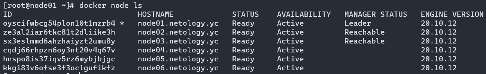
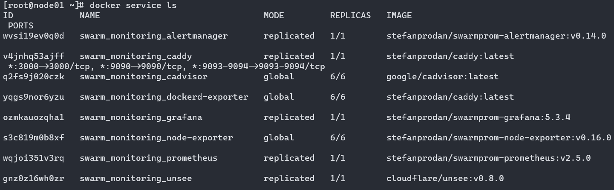

# 5.5. Оркестрация кластером Docker контейнеров на примере Docker Swarm

## Задача 1

1. В чём отличие режимов работы сервисов в Docker Swarm кластере: replication и global?
   - В режиме global сервис будет установлен на каждую машину в кластере в одном экземляре (мониторинг, антивирус и т.п.). При добавлении новой машины в кластер она также получит данный сервис
   - В режиме replication в кластере будет требуемое количество экземляров сервиса. В том числе сервис может присутствовать на одной и той же машине в нескольких экземлярах сразу
2. Какой алгоритм выбора лидера используется в Docker Swarm кластере?
   - The Raft Consensus Algorithm, демонстрация работы [тут](http://thesecretlivesofdata.com/raft/)
3. Что такое Overlay Network?
   - Оверлейная сеть - это сеть, которая работает поверх другой сети. Примером может быть VPN

## Задача 2

Создать ваш первый Docker Swarm кластер в Яндекс.Облаке

**Ответ**

Скриншот из терминала (консоли), с выводом команды ``docker node ls``:




## Задача 3

Создать ваш первый, готовый к боевой эксплуатации кластер мониторинга, состоящий из стека микросервисов.

**Ответ**

Скриншот из терминала (консоли), с выводом команды: ``docker service ls``:




***Подробности выполнения задач 2 и 3***:


## Задача 4 (*)

Выполнить на лидере Docker Swarm кластера команду (указанную ниже) и дать письменное описание её функционала, что она делает и зачем она нужна:
```
# см.документацию: https://docs.docker.com/engine/swarm/swarm_manager_locking/
docker swarm update --autolock=true
```
